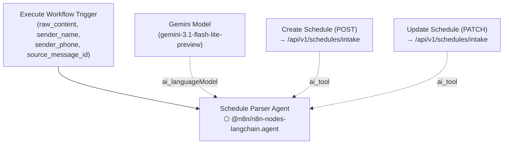

Prompt-bearing nodes:
- `Schedule Parser Agent` → `n8n/prompts/schedule-parser-agent__schedule-intake-sub-workflow.md`

Supporting nodes:
- `Execute Workflow Trigger` — explicit workflow input schema with `raw_content`, `sender_name`, `sender_phone`, and `source_message_id`
- `Create Schedule (POST)` — HTTP POST AI tool; used for brand-new schedules; sends to `/api/v1/schedules/intake`; expects every item to include a valid `item_type`
- `Update Schedule (PATCH)` — HTTP PATCH AI tool; used for corrections or additions to an existing schedule; same endpoint; expects every item to include a valid `item_type`
- Both tools have `neverError: true` and `retryOnFail: true` (max 2 tries)

The parser agent now owns schedule normalization from raw text, including `item_type` resolution and HH:MM time normalization. It decides whether to POST (new) or PATCH (update) based on the intent described in the user prompt, and if the API returns validation details it retries the same method once before returning the final error upstream.
