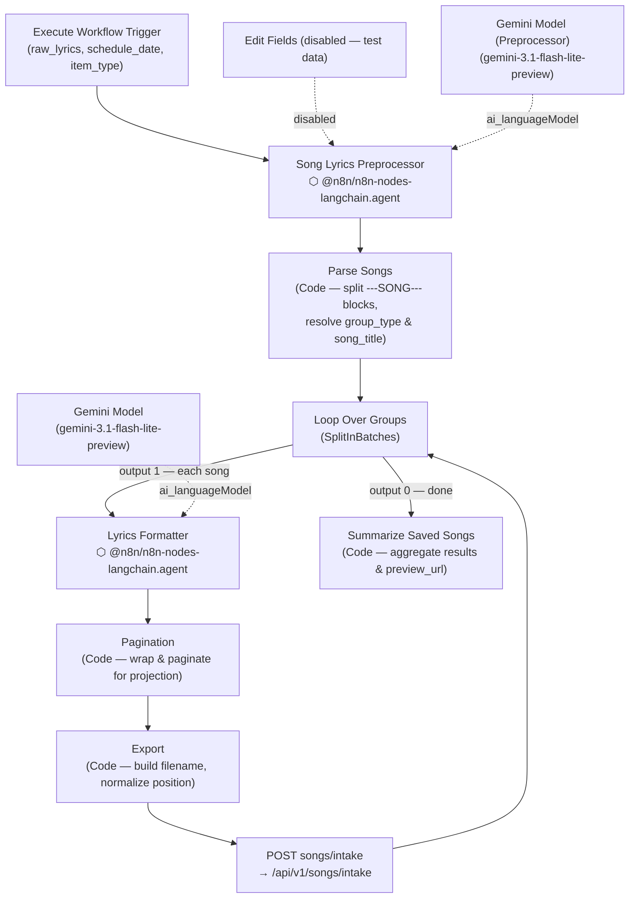

Prompt-bearing nodes:
- `Song Lyrics Preprocessor` → `n8n/prompts/song-lyrics-preprocessor__song-lyrics-intake-sub-workflow.md`
- `Lyrics Formatter` → `n8n/prompts/lyrics-formatter__song-lyrics-intake-sub-workflow.md`

Supporting nodes:
- `Edit Fields` — disabled test-data shim; pre-populates `raw_lyrics`, `schedule_date`, and `item_type` for manual runs
- `Parse Songs` — JavaScript Code node; splits the preprocessor's `---SONG---` plain-text output into individual song items with `group_type`, `raw_lyrics`, `song_title` (first lyric line), `position`, `schedule_date`, and `item_type`
- `Loop Over Groups` (`splitInBatches`) — iterates one song at a time; output 0 fires when the batch is exhausted (goes to summary), output 1 fires for each item (goes to formatter)
- `Pagination` — JavaScript Code node; parses the formatter's JSON, wraps long lines at 45 chars, inserts blank-line slide breaks every 2 lyric lines
- `Export` — JavaScript Code node; finalises `filename`, normalises `position`, trims `formatted_lyrics`
- `POST songs/intake` — HTTP POST to `/api/v1/songs/intake`; `neverError: true`, `retryOnFail: true` (max 2 tries); loops back into `Loop Over Groups`
- `Summarize Saved Songs` — final Code node; aggregates all saved songs into a summary payload (`song_count`, `songs[]`, `preview_url`, `linked_to_schedule`, `schedule_date`)
