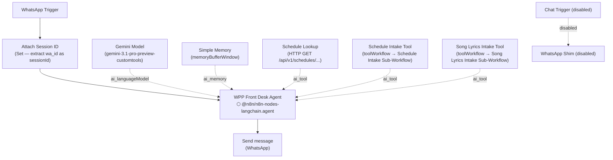

Prompt-bearing nodes:
- `WPP Front Desk Agent` → `n8n/prompts/wpp-front-desk-agent__worship-prep-platform-dev.md`

Supporting nodes:
- `Attach Session ID` — extracts `wa_id` from the WhatsApp payload and attaches it as `sessionId` for the reply node
- `Schedule Lookup` — HTTP GET tool; calls `/api/v1/schedules/{date}` or `?upcoming=true` on behalf of the agent
- `Schedule Intake Tool` — delegates to the Schedule Intake Sub-Workflow (`yLfyYiLy9RnTlbUU`); passes `raw_content`, `sender_name`, `sender_phone`, and `source_message_id`; the front desk agent now routes raw schedule text instead of parsed agenda items
- `Song Lyrics Intake Tool` — delegates to the Song Lyrics Intake Sub-Workflow (`oQdiLHbdYm7wGgbD`); passes `raw_lyrics`, `schedule_date`, `item_type`
- `Chat Trigger` + `WhatsApp Shim` — disabled dev-testing shim nodes; not part of the live execution path
